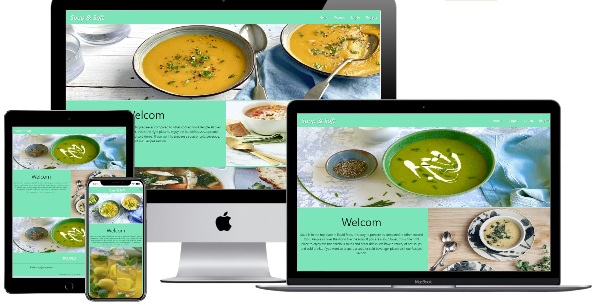
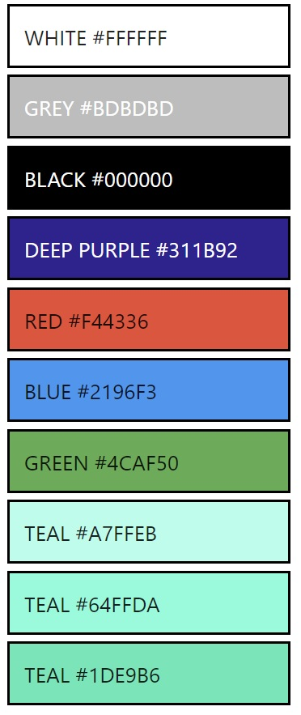
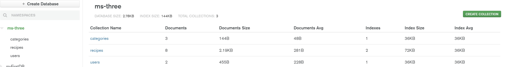
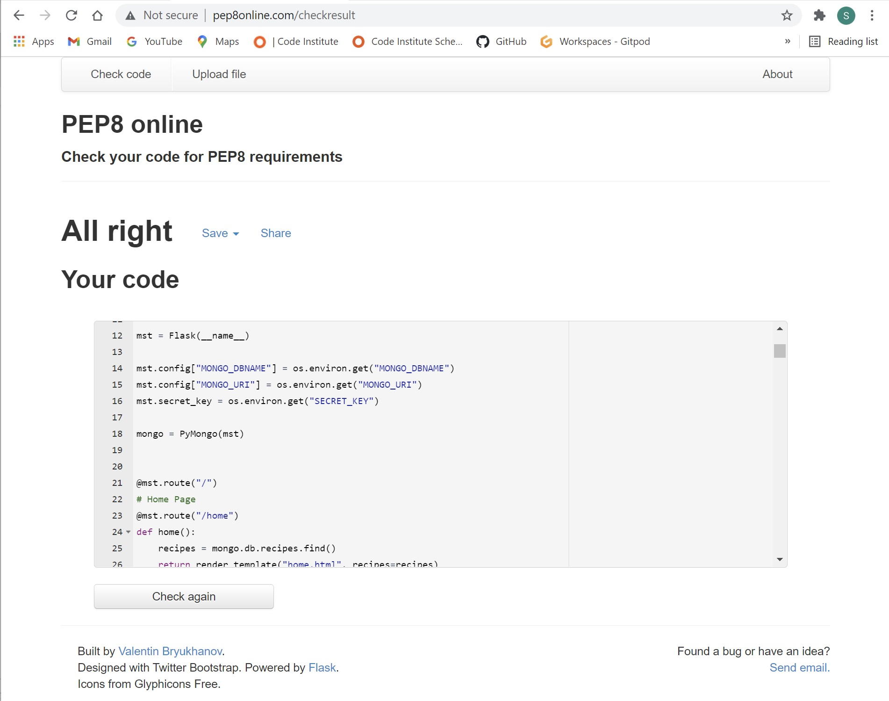
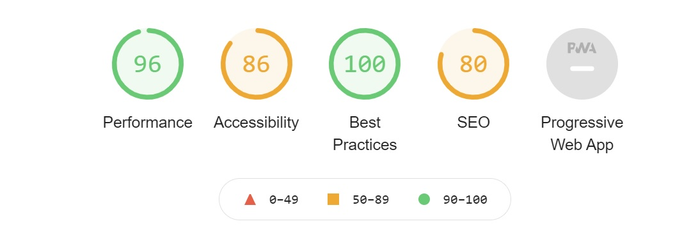

# Milestone Three Project - Soup & Soft
Soup & Soft is a soup and drink shop sells a variety of soup and drinks. The target audience of this website is soup lovers who want to prepare soup and beverages themselves. Everyone is welcome.

Recipes are visible to all visitors. Only registered users can upload recipes and can edit their own recipes.
Registration is open to all visitors.

To visit the website please click [Here](https://milestone-three-pro.herokuapp.com/)

## Contents

- [**User Experience (UX)**](<#user-experience-(ux)>)

  - [Project Goals](#project-goals)
  - [User Goals](#user-goals)
  - [Design](#design)
  - [Wireframes](#wireframes)

- [**Features**](#features)

  - [Existing Features](#features)

- [**Technologies**](#technologies-used)

  - [Languages Used](#technologies-used)
  - [Frameworks, Libraries and Programs Used](#technologies-used)

- [**Testing**](#testing)

- [**Deployment**](#deployment)

## User Experience (UX)

### Project Goals
- Create a website to inspire users to share their favourite recipes.
- Create and implement navigation throughout the site to help users to register,     login and manage their posts/recipes.
- Implement  CRUD (create, read, update and delete) functionalities for users recipes.
- Implement following technologies:  
CSS, Flask, HTML, JavaScript, MongoDB and Python

## User Stories

### User Goals:
#### New User Goals:  
As a new user, I want to achieve the following goals.  
a- I want to be able to view all shared recipes.    
b- I want to be able to register on the website.  
c- I want to be able to share/upload my recipes.    
### Returning User Goals:  
a- As a returning user, I want to be able to log in and log out.  
b- As a returning user, I want to be able to edit ot delete my recipes posted on the website.   
### Site Owner User Goals:  
a- As the site owner, I want to share the recipes uploaded on this website.  
b- As the site owner, I want to attract the audience with the nice and attractive design of the website.  

### Design  
* The design of this project is simple.  
Materializecss.com framework was used to build this project website.  

### Colors  
* I used followig colours including text colors.  
  

### Typography  
- I used the operating system default font to enhance the compatibility.  

### Wireframe  
- To view the project wireframe please click [Here](https://github.com/mqsaud/milestone-three/blob/main/Soup%26Soft%20Cafe.pdf)  

## Features

### Existing Features : 

- **Navigation**:  
  Standard Materialize based navigation bar was added with a clear name of the company on the left in desktop view and centred in mobile view.

- **Footer**:  
The footer includes the email address and Social link icons.

- **Home Page**:  
The landing page contains a separate beautiful hero image for each device type. The navbar offers the user to register or login

- **Profile**:  
Once logged in, the user will transfer onto the profile page. Here the user will be able to edit or delete their uploaded recipes. 

- **Flash messages**  
Customized flash messages will appear for successful and non-successful registration, successful login and logout, successful update, successful edit and added recipes.

- **Add / Edit recipe** :   
Once the user logged in, users can see the option to Add or Edit the recipe. On the navbar, they will see the option "Add Recipe". Once clicked, they will fill the relevant information in the form, and by clicking " Add Recipe", the recipe will upload to the website and be available for viewing to all visitors. Any registered user can edit or delete only their own uploaded recipe.

- **Delete**:  
If a user wants to delete a recipe, they will have to login first. There is a  defensive check by using a pop-up modal, asking them to think one more time before deleting the recipe.

- **Logout**:  
If the user clicks "Logout", they will be redirected to the "Log In" page, as they might need to login again.

- **Search**:  
As the site grows, there will be more recipes; therefore, search functionality has been added to search the recipes.

**Database skeleton**

- The skeleton of my database is as follows : 

- **categories** : 

    category_name

- **recipes** : 

    recipe_name

    category_name

    img_url

    ingredients

    method --> Cooking Procedure

    veg_no_veg --> Is the recipe vegetarian or non-vegetarian.

    added_by

- **users** :

    username

    password
    
**Security**

- The website uses [Werkzeug's](https://werkzeug.palletsprojects.com/en/1.0.x/) password protection system.  Werkzeug hashes the password entered by the user, converts the password into another string and then it is salted (additional data added). The hash of the password is stored in the database. This makes the password very tough to crack.

- Database configurations, username, password/"secret key" are stored in a separate file, and gitpod's .gitignore file was used to prevent this file from uploading to GitHub.

#### [Back to Contents](#contents)

---

## Technologies Used
- Following languages and frameworks were used to build the website

### Languages

 [HTML5](https://en.wikipedia.org/wiki/HTML5)
>
 [CSS3](https://en.wikipedia.org/wiki/Cascading_Style_Sheets)
>
 [JavaScript](https://en.wikipedia.org/wiki/JavaScript)

 [Python](https://en.wikipedia.org/wiki/Python_(programming_language))

### Frameworks, Libraries and Programs:

 [Flask](https://fontawesome.com/)

 [MongoDB](https://www.mongodb.com/) 

 [Gitpod](https://www.gitpod.io/) 

 [Materialize](https://materializecss.com/about.html) 

 [Font Awesome](https://fontawesome.com/) 

 [Balsamiq](https://balsamiq.com/) 

#### [Back to Contents](#contents)

---

## Testing

### Code validity

**PEP8 Compliant:**  
I used [PEP8](http://pep8online.com/) to check my mst.py files complied with the PEP8 requirements. The results was no error.
  

**W3C CSS Validator**   
I used the [W3C CSS Validator](https://jigsaw.w3.org/css-validator/) to check the validity of my CSS file. Test was passed with **no** error.  

**W3C HTML Validator**  
I used the [W3C HTML Validator](https://validator.w3.org) to check the validity of my HTML code for each page. Test was passed with **no** error, except Flask errors.  

**JSHINT**  
I used  [JSHINT](https://jshint.com/) to check validity of my JS code and ther was no error.  

## Testing User Stories

### Testing New User Goals:    
* ### a- I want to be able to view all shared recipes.   
On the landing page, I found two links/buttons, one on the navbar and the other just above the footer. I pressed one of the buttons, a recipe page opened. There I found all the recipes uploaded by many users.  
A recipe search function is also provided to search recipes.  

* ### b- I want to be able to register on the website.  
To register myself on this website, I clicked on the register link that opened the registration page. After filling in the relevant information, I pressed the "Register" button and a flash message " Registration Successful!" appeared. My profile page opened.  

* ### c- I want to be able to share/upload my recipes.  
To share/upload my recipe, I clicked on the "Add Recipe" link on the navbar. A recipe form appeared. I fill in all the required information and click on the "Add Recipe" button at the bottom of the form. A flash message "Your Recipe Successfully Added ". And Recipes page opened where I can see my recently uploaded recipe.  

### Returning User Goals:  
* ### a- As a returning user, I want to be able to log in and log out.  
I clicked on the "Log In" link on the home page. The login form appeared. After filling in the required fields, I clicked on the "Log In" button. My profile page opened with all my uploaded recipes.
To log out, I clicked on the "Log Out" link.   The login page opened with a flash message " You have been logged out."  
* ### b- As a returning user, I want to be able to edit or delete my recipes posted on the website.  
To edit or delete the recipe, the user must be logged in.  After login, I opened my profile page and clicked on the edit button given below the recipe. "Edit Recipe" form opened.  After the required editing, I clicked on the edit button. The recipe was updated with the flash message "Your Recipe Successfully Updated" Then I clicked the cancel button, my profile page opened again.  
To delete the recipe, I clicked on the "Delete" button on the recipe on my profile page. A following popup warning message appeared with YES and NO buttons.  
"Delete For All Eternity?  
Warning! If you press " YES ", The recipe will be permanently deleted, and we will not be able to recover it.  
Are you sure you want to permanently delete this recipe? "  
I clicked on the YES button, and the recipe  was deleted with the flash message "Recipe has been Successfully Deleted"  
### Site Owner User Goals:  
* ### a- As the site owner, I want to share the recipes uploaded on this website.  
When a user visits the site and clicks on the "Recipes" link available on the navbar, the recipes page opens, displaying all the recipes. When the user clicks on the "Learn More" button, a new page opens with all the details of that recipe.

* ### b- As the site owner, I want to attract the audience with the nice and attractive design of the website.  
The design of the website is very beautiful. It has eye-catching images. The navigation is straightforward and easy.  

### Further Testing  
- Browsers  
The website was tested on Chrom, Firefox, Cclean, SeaMonkey, Edge, Opera and InternetExplorer. It is working great on all browsers.  Only InternetExplorer has an issue with <picture></picture> command. This command is not compatible with the InternetExplorer. The InternetExplorer only run  command.  

- Mobile Devices  
The website was tested on Samsung A70 and OPPO A74 5G.  It works well on these devices.  

## Bugs
- The "Add Recipe" page was available without logging in by typing its address on the browser's address bar.  
Solution: Add session cookie check code in the "add_recipe" function that redirects the user to the login page if the user was not logged in.  
- A part of the logo went outside the navbar on mobiles devices due to the white spaces in the logo.
Solution: To remove the white spaces, I add "&nbsp"; at the white spaces of the logo.  

### Deploying Website at Heroku.com
1- In the terminal, create a requirements.txt and Procfile using the following commands:  

    - a: pip3 freeze --local > requirements.txt  
    - b: echo web: python mst.py > Procfile  

2- Commit the these two new files to GitHub  
3- In Heroku.com account I created a new App called "milestone-three-pro" and chose the region Europe.  
4. In deploy sections which opened automatically after creating the app, I clicked on the GitHub logo to connect my GitHub repository with this Heroku account.  
5. In search bar I typed my GitHub repository name "milestone-three" and hit search. When the correct repository was found I clicked the ‘connect’ button.  
6. Next, I clicked on ‘Settings’, and then on "Reveal Config Vars" tab. I filled in the Config Vars with relevant information same as the info was stored in env.py file in gitpod.  
7. In Deploy, I clicked "Enable Automatic Deploy"  from the Main branch.  
8. Then clicked ‘Deploy Branch’ and the app was deployed successfully at the URL https://milestone-three-pro.herokuapp.com/  

### To Create a Clone of the milestone-three Repository  
Cloning the repository makes a copy of the of the repository, download it and store on your local computer.  
To clone the repository on the local computer "GitHub Desktop" ,"Git"  and microsoft "VS Code" must be installed on the local computer

To make a clone of "mqsaud/milestone-three", follow the following steps:  
1. Visit the main repository of milestone-three [here](https://github.com/mqsaud/milestone-three)  
2. Click on the button with the text **"Code"**.  
3. Click on **“Open with GitHub Desktop”** and follow the on screen instructions, a cloned local copy from your hard disk will open in "VS Code"  

### Development-Life-cycle
The development life cycle of the project consists of the following steps.   
1. Concept.  
2. Feasibility and Research  
3. User experience and sketch  
4. Coding   
5. Testing  
6. Hosting  
7. Future Maintainability  

#### 1. Concept
The Project starts from an Idea or Concept. In this Project, the concept of a food shop website and a Plant shop were selected.  

#### 2. Feasibility and Research
I discussed the feasibility of these concepts with my mentor, and he gave an okay signal for the Soup and Drink shop website  

#### 3. User Experience and sketch
Using the User Experience guidelines, I draw the sketches of  all pages of the website. I used Balsamiq wireframe software to draw the sketches.  

#### 4. Coding
HTML5, CSS3, Python and javaScript are the main software used to build this project. Materializecss framework used to give a stylish and professional look to the project. Github and gitpod online platform was used to write and save the project. Gitpod's version control system was used for version control. Microsoft VS Code IDE  built-in gitpod was used for code writing. MongoDB plateform was used as a database storage and Heroku was to host the project.  

#### 5. Testing
Two methods were adopted to test this project.  
a. Manual Testing  
b. Third-Party Test services  

##### a. Manual Testing
In this method, the website was opened in different web browsers and checked every page, link and button.  
##### b. Third Party Testing services
W3C validation services were used to validate HTML and CSS files.  
I used  [JSHINT](https://jshint.com/) to check validity of my JS code.    
Chrome Lighthouse Dev tool was used to check the website performance.  
https://responsivedesignchecker.com/ was used to check the responsiveness of the website.  

#### 6. Hosting  
Heroku.com cloud hosting service used to host the website.

#### 7. Future Maintainability
For future maintainability CSS and all HTML pages are divided into sections. Meaningful names of HTML IDs and CLASSes were chosen to facilitate the developer who may work on this project  in future.

### Contents 
All cotents are written by me. 
 
### Media 
Most of the pictures are taken from internet. All credits are given at the point of use.  

### Acknowledgment
My mentor for his support and feedback.   
Code Institute tutor support

#### [Back to Contents](#contents)

